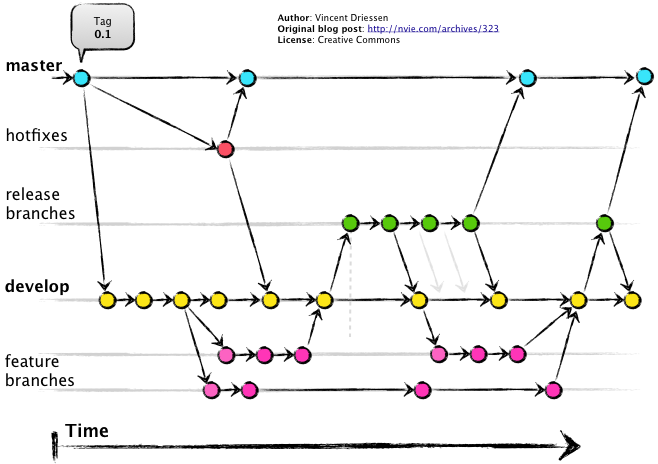

# Git Flow

Info oficial -> [Git Flow](https://nvie.com/posts/a-successful-git-branching-model/)

Git Flow es una forma ordenada de trabajar con GIT en proyectos SW. Consiste en tener todo separado por ramas y seguir una política de rabajo y commits muy específicas con ellas. Así que tendremos:

* `master`:
    * Rama principal que tendrá código final (testado y validado) preparado para ser subido a producción o en producción.
    * No se trabaja sobre ella, es decir, todo el código que le llega es a través de un merge.
    * Todos los "commits" (merges) que hay sobre ella, tienen un `tag` definido, que indica la versión del programa.
* `develop`:
    * Es la rama de desarrollo principal.
    * Para implementar git-flow al menos deben de estar `master` y `develop`.
    * Tiene código de futuras versiones (`master` solo código estable para producción).
    * De ella derivan las demás ramas de desarrollo.
* `feature-<característica>`:
    * Estas son ramas que parten de `develop`.
    * Son para desarrollar una única característica por rama.
    * Cuando se acaba, se mergea con `develop` y se finaliza la rama.
* `release-<version>`:
    * Parten de `develop`.
    * Tienen código estable preparado para ser subido a `master` a falta de un buen testeo.
    * Una vez su código está listo, se mergea tanto con `develop` como con `master` y se finaliza la rama.
* `hofix-<version>`:
    * Parten de `master`.
    * Si en producción se encuentra un error, se genera esta rama, con la versión del código en producción como nombre, se arregla.
    * Por último se mergea con `develop` como con `master` (poniéndole un `tag` que aumente la versión) y se finaliza la rama.
* `support-<version>`:
    * Esto no lo cubre en realidad Git Flow.
    * Las ramas support son para si se mantienen distintas versiones al mismo tiempo.
    * Sería equivalente a una rama `master` pero solo para una versión `major` de tu programa.

Pueden existir incluso más ramas, como las `pull-request/<version>`.

Ejemplo de Git Flow en vertical

Ejemplo de Git Flow en horizontal

Otra imagen en horizontal de Git Flow

## Instalación

TODO
